# webdev-pr1-http
# Практична робота № 1 — Дослідження мережевих протоколів засобами інструментів розробника

Навчальний проєкт, у якому досліджено протоколи HTTP/HTTPS за допомогою **Postman**, **curl** та **DevTools** браузера. Код тут не компілюється — «програмою» є набір запитів і зафіксовані результати їх виконання.

## Мета роботи

- Опанувати інструменти дослідження HTTP/HTTPS: `curl`, Postman, DevTools.
- Набути навичок формування та аналізу HTTP-запитів (`GET`, `POST`, `PUT`, `DELETE`), статусів і заголовків.
- Дослідити TLS/HTTPS, життєвий цикл і атрибути безпеки Cookie (`HttpOnly`, `Secure`, `SameSite`) та політику CORS.

## Середовище

| Компонент | Значення |
| --- | --- |
| ОС | Windows |
| curl | 8.21.0 (Schannel) |
| Клієнт API | Postman |
| Редактор | Visual Studio Code |
| Браузер | Chromium-браузер із DevTools |
| Тестові API | <https://dummyjson.com/>, <https://httpbin.org/> |

## Структура репозиторію

```text
.
├── README.md                 # цей файл
├── report/                   # повний звіт (.docx)
├── postman/                  # колекція Postman (postman_collection.json)
└── screenshots/              # скриншоти виконання
```

## Інструкція запуску

Ніякого встановлення проєкту не потрібно — достатньо інструментів із розділу «Середовище».

1. Перевірте, що `curl` доступний: `curl --version`.
2. Імпортуйте `postman/postman_collection.json` у Postman (**Import → File**) і виконайте запити по черзі.
3. Виконайте команди `curl` з розділів нижче в терміналі.

> Команди наведено для **cmd** у Windows. У **PowerShell** пишіть `curl.exe` замість `curl` (`curl` там — псевдонім `Invoke-WebRequest`). У Linux/macOS замість `\"` усередині JSON використовуйте одинарні лапки: `-d '{"title":"Test"}'`.

---

## Рівень 1. HTTP через Postman та DevTools

### 1.1 Перевірка середовища

```bash
curl --version
```

### 1.2 Методи REST API в Postman

| Запит | Результат | Скриншот |
| --- | --- | --- |
| `GET https://dummyjson.com/products/1` | `200 OK`, 265 мс, 1.69 КБ | 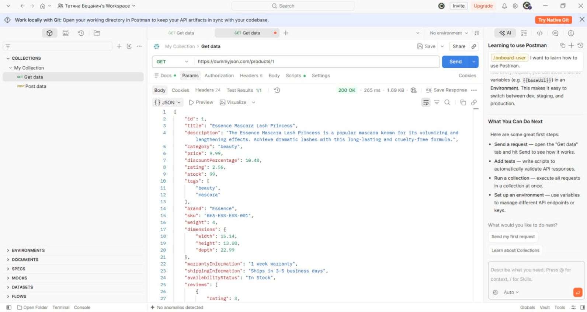 |
| `POST https://dummyjson.com/products/add` | `201 Created`, згенерований `id` = 195 | 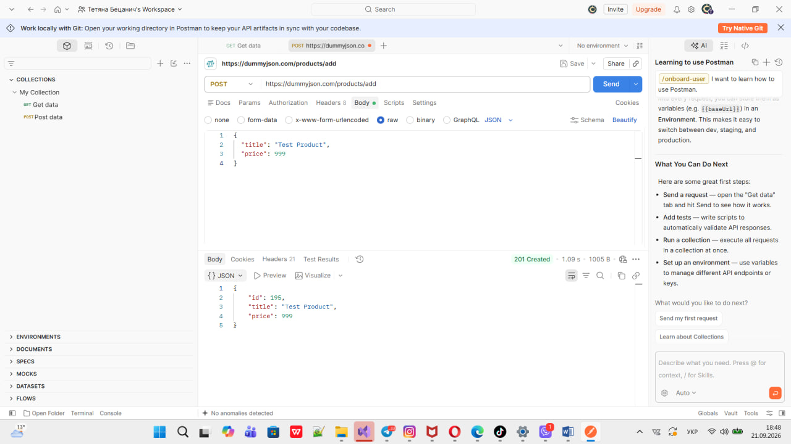 |
| `PUT https://dummyjson.com/products/1` | `200 OK`, оновлено `title`, інші поля без змін | 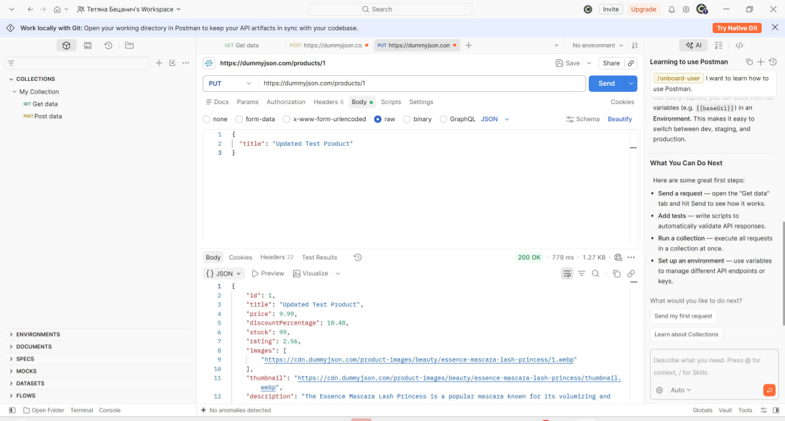 |
| `DELETE https://dummyjson.com/products/1` | `200 OK`, `isDeleted: true` | 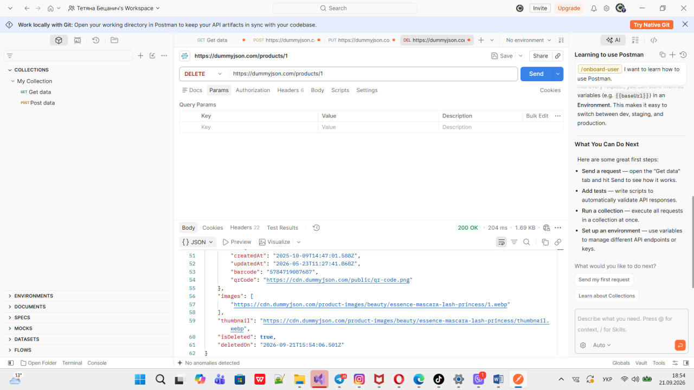 |

Колекцію збережено у `postman/postman_collection.json`.

### 1.3 Аналіз у DevTools (вкладка Network)

Запит `GET https://dummyjson.com/products`: статус `200 OK`, remote address `104.21.61.23:443`, `content-type: application/json; charset=utf-8`, `server: cloudflare`, є заголовок `etag`. TTFB — 30.14 мс, завантаження вмісту — 1.47 мс. Фази DNS Lookup та Initial connection відсутні, бо браузер повторно використав уже відкрите з'єднання (keep-alive).

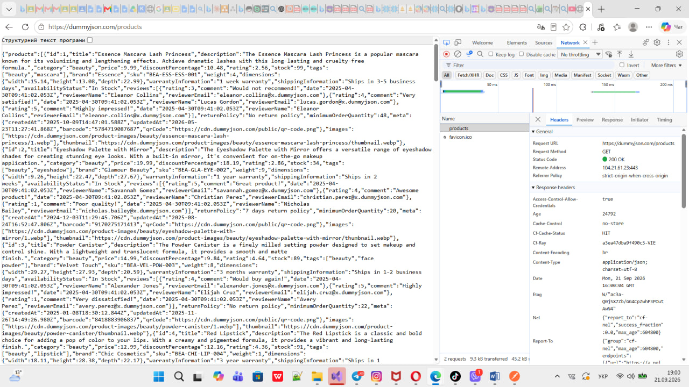
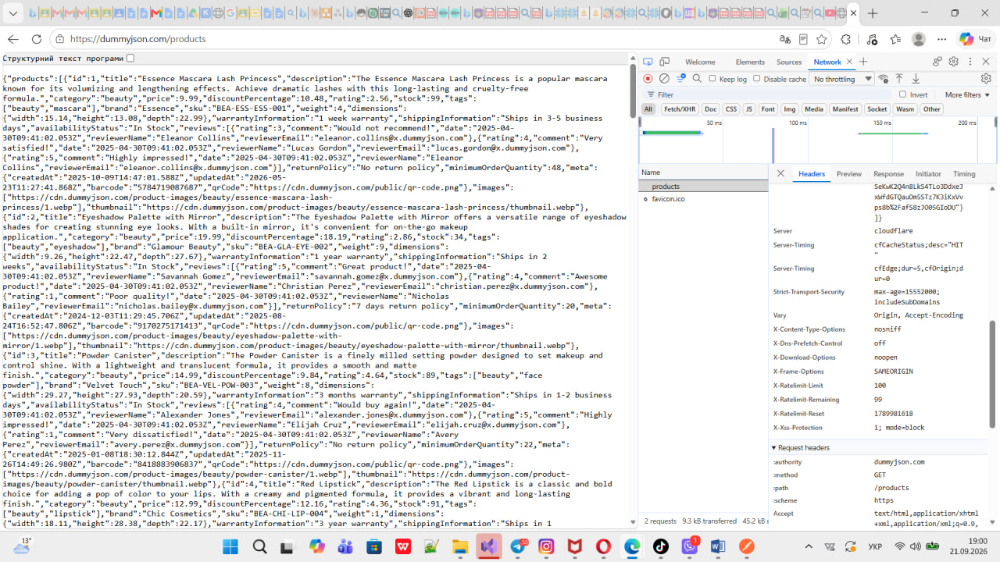
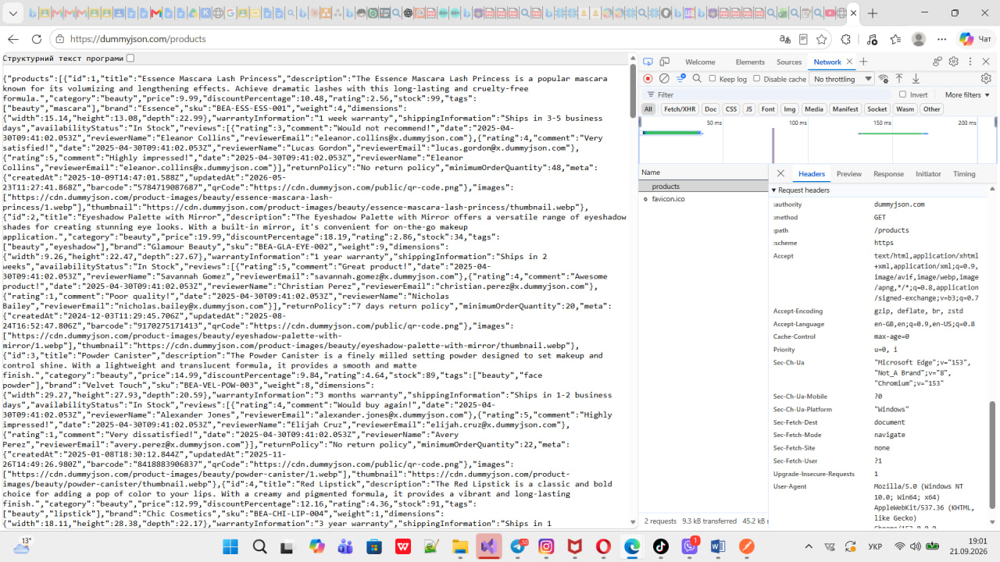
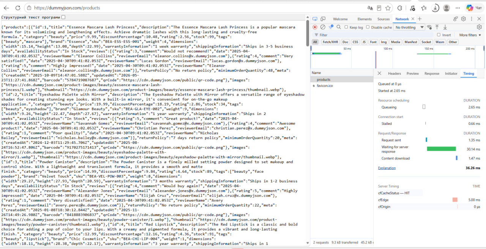

---

## Рівень 2. Консольна діагностика через curl

### 2.1 Базові виклики

```bash
curl "https://dummyjson.com/users?limit=2&select=firstName,email"

curl -X POST https://dummyjson.com/posts/add -H "Content-Type: application/json" -d "{\"title\":\"My test post\",\"userId\":5}"
```

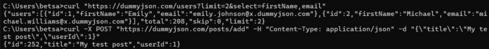

### 2.2 Заголовки та статуси без завантаження тіла

```bash
curl -I https://dummyjson.com/products
curl -i https://httpbin.org/status/404
curl -i https://httpbin.org/status/500
```

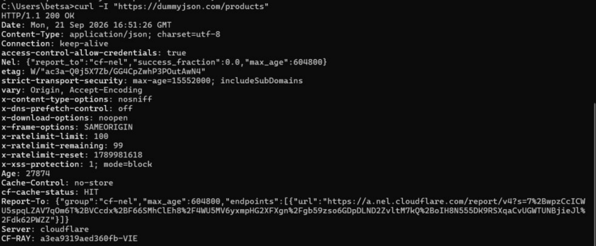
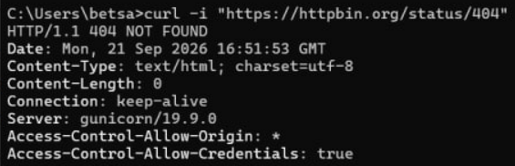
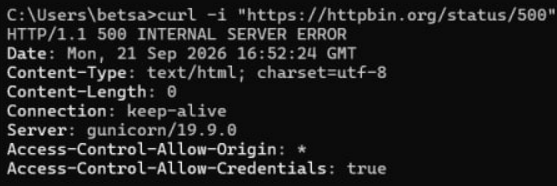

### 2.3 Автентифікація через Bearer-токен

```bash
curl -X POST https://dummyjson.com/auth/login -H "Content-Type: application/json" -d "{\"username\":\"emilys\",\"password\":\"emilyspass\"}"

curl https://dummyjson.com/auth/me -H "Authorization: Bearer <TOKEN>"
```

`<TOKEN>` — значення поля `accessToken` з відповіді першого запиту.

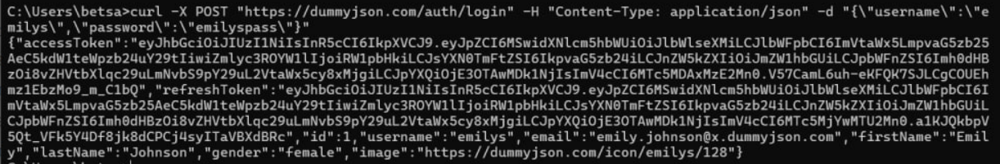
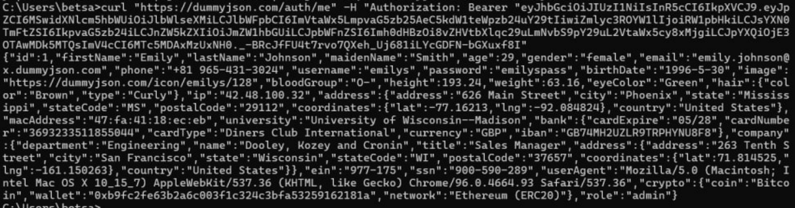

### 2.4 Мережеві метрики

```bash
curl -s -o NUL -w "DNS: %{time_namelookup}s | TCP: %{time_connect}s | TLS: %{time_appconnect}s | TTFB: %{time_starttransfer}s | Total: %{time_total}s\n" https://dummyjson.com/products
```


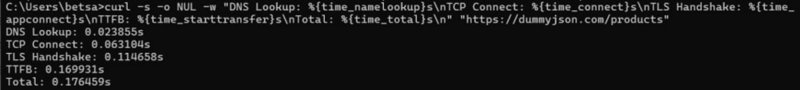

---

## Рівень 3. HTTPS/TLS, Cookie та CORS

### 3.1 TLS Handshake

```bash
curl -v https://dummyjson.com/products/1
```

- **TCP:** `104.21.61.23`, порт `443`.
- **ClientHello / ServerHello:** curl зі Schannel не виводить їх окремими рядками; видно узгодження ALPN (`http/1.1`) та повідомлення про перепогодження параметрів з'єднання.
- **Сертифікат:** видавець — Google Trust Services (CN=WE1), дійсний з 08.08.2026 по 06.11.2026, SAN — `dummyjson.com` і `*.dummyjson.com`.
- **Протокол і шифр:** TLS 1.3, AES-256.

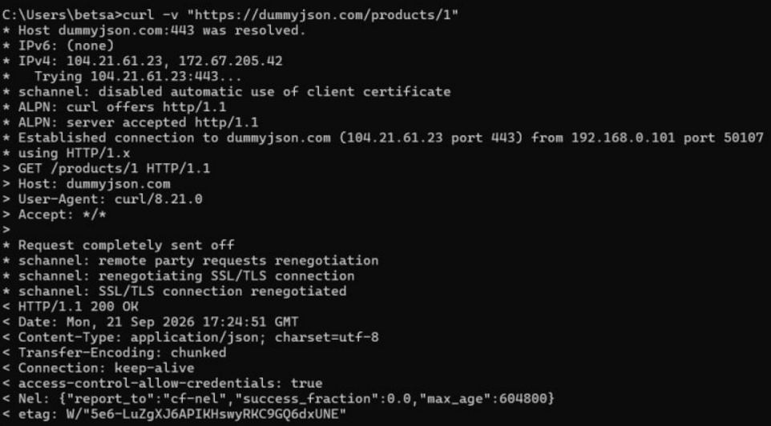
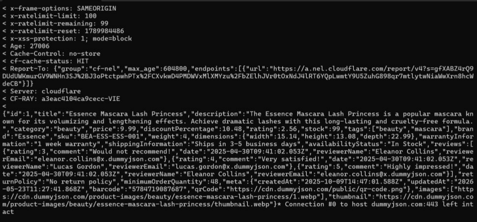
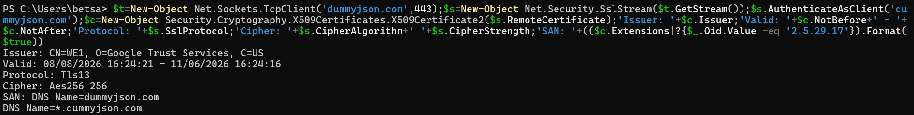

**Примусове звернення через HTTP:**

```bash
curl -I http://dummyjson.com/products/1
```

Сервер повертає `301 Moved Permanently` із заголовком `Location: https://dummyjson.com/products/1`.

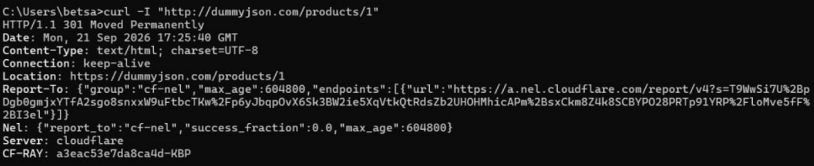

### 3.2 Cookie Jar

```bash
curl -c cookies.txt "https://httpbin.org/cookies/set?user_role=student&session_key=lab1_token"
type cookies.txt
curl -b cookies.txt https://httpbin.org/cookies
```

(`type` — для cmd; у Linux/macOS/PowerShell використовуйте `cat`.) Сервер у тілі відповіді повернув обидва збережені cookie: `session_key` і `user_role`.

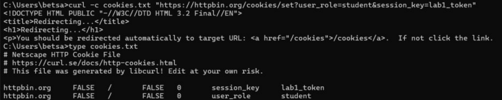
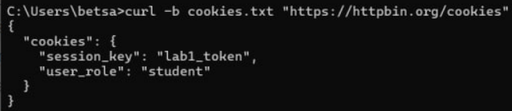

### 3.3 Атрибути безпеки Cookie

```bash
curl -i "https://httpbin.org/response-headers?Set-Cookie=session_id=xyz789;%20Path=/;%20Secure;%20HttpOnly;%20SameSite=Strict"
```

| Атрибут | Значення | Від чого захищає |
| --- | --- | --- |
| `HttpOnly` | присутній | крадіжка cookie через XSS (JavaScript не бачить `document.cookie`) |
| `Secure` | присутній | передача cookie через незашифрований HTTP |
| `SameSite` | `Strict` | CSRF-атаки (cookie не надсилається з міжсайтових запитів) |

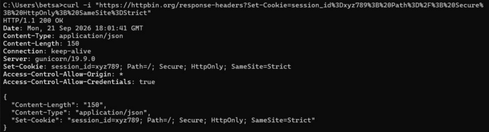

### 3.4 CORS: Preflight-запит

```bash
curl -i -X OPTIONS https://httpbin.org/post -H "Origin: https://my-college-app.edu" -H "Access-Control-Request-Method: POST" -H "Access-Control-Request-Headers: Content-Type, Authorization"
```

Сервер відповів `200 OK` і повернув:

| Заголовок | Значення |
| --- | --- |
| `Access-Control-Allow-Origin` | `https://my-college-app.edu` |
| `Access-Control-Allow-Methods` | `GET, POST, PUT, DELETE, PATCH, OPTIONS` |
| `Access-Control-Allow-Headers` | `Content-Type, Authorization` |

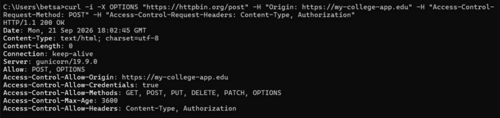

---

Контрольні питання
1. Чим відрізняється стартовий рядок HTTP-запиту від статусного рядка HTTP-відповіді?

Стартовий рядок запиту містить:

HTTP-метод;
шлях до ресурсу;
версію протоколу.

Наприклад: GET /api/v1/resource HTTP/1.1.

Статусний рядок відповіді містить:

версію протоколу;
тризначний код статусу;
текстове пояснення статусу.

Наприклад: HTTP/1.1 200 OK.

2. Яка різниця між safe та idempotent методами HTTP?

Безпечний (safe) метод не повинен змінювати стан ресурсу. Ідемпотентний (idempotent) метод при багаторазовому виконанні має той самий ефект, що й одноразове виконання.

Метод	Безпечний	Ідемпотентний
GET	так	так
POST	ні	ні
PUT	ні	так
DELETE	ні	так
3. Що означають коди 2xx, 3xx, 4xx та 5xx?
2xx — запит успішно виконано.
3xx — перенаправлення.
4xx — помилка на стороні клієнта.
5xx — помилка на стороні сервера.

Приклади:

201 Created — ресурс успішно створено.
301 Moved Permanently — ресурс постійно перенесено на іншу адресу.
401 Unauthorized — потрібна автентифікація.
403 Forbidden — сервер зрозумів запит, але забороняє доступ.
404 Not Found — ресурс не знайдено.
500 Internal Server Error — внутрішня помилка сервера.
4. Для чого потрібні Content-Type та Accept?

Content-Type повідомляє, у якому форматі передаються дані в тілі запиту або відповіді. Наприклад: Content-Type: application/json.

Accept повідомляє серверу, який формат відповіді бажає отримати клієнт.

Таким чином клієнт і сервер можуть домовитися про формат даних — це називається Content Negotiation.

5. Опишіть етапи TLS Handshake. Чому HTTP небезпечний у відкритій мережі?

Основні етапи TLS Handshake:

ClientHello — клієнт передає підтримувані версії TLS, шифронабори та SNI.
ServerHello — сервер обирає версію TLS та алгоритм шифрування.
Certificate & Key Exchange — сервер передає сертифікат і відбувається формування спільних ключів.
Finished — після завершення узгодження використовується симетричне шифрування, наприклад AES-GCM або ChaCha20.

HTTPS використовує TLS для шифрування HTTP-трафіку. Звичайний HTTP не забезпечує такого захищеного шифрування, тому конфіденційні дані можуть бути перехоплені у відкритій мережі.

6. Що таке TTFB?

TTFB (Time To First Byte) — це час від початку виконання запиту до отримання першого байта відповіді від сервера.

На нього впливають, зокрема:

DNS-резолвінг;
встановлення TCP-з'єднання;
TLS Handshake для HTTPS;
час очікування відповіді сервера.

У роботі TTFB вимірюється за допомогою curl та параметра -w.

7. Для чого потрібні HttpOnly, Secure та SameSite?
HttpOnly — забороняє JavaScript отримувати доступ до cookie через document.cookie, що допомагає захистити сесію від крадіжки через XSS.
Secure — дозволяє передавати cookie тільки через захищене HTTPS-з'єднання.
SameSite — контролює передачу cookie під час міжсайтових запитів і допомагає захищатися від CSRF-атак.
8. Що таке Preflight-запит у CORS?

Preflight-запит — це попередній HTTP-запит методом OPTIONS, який браузер надсилає серверу перед основним запитом, щоб перевірити, чи дозволена така міжсайтова взаємодія.

Він використовується, зокрема, для запитів із методами POST, PUT, DELETE або нестандартними заголовками.

У запиті можуть передаватися:

Origin;
Access-Control-Request-Method;
Access-Control-Request-Headers.
Висновки

У ході виконання практичної роботи було досліджено принципи роботи протоколу HTTP/HTTPS та структуру клієнт-серверної взаємодії. Було опрацьовано основні HTTP-методи GET, POST, PUT і DELETE, коди статусів та керуючі заголовки.

За допомогою Postman, curl і DevTools було виконано та проаналізовано HTTP-запити, їхні заголовки, статуси й часові характеристики. Також було досліджено механізм TLS Handshake, роботу Cookie та їхніх атрибутів HttpOnly, Secure, SameSite, а також принцип роботи CORS і Preflight-запитів.

У результаті було отримано практичні навички діагностики мережевої взаємодії, аналізу HTTP/HTTPS-запитів і відповідей та використання інструментів розробника для дослідження роботи REST API.
